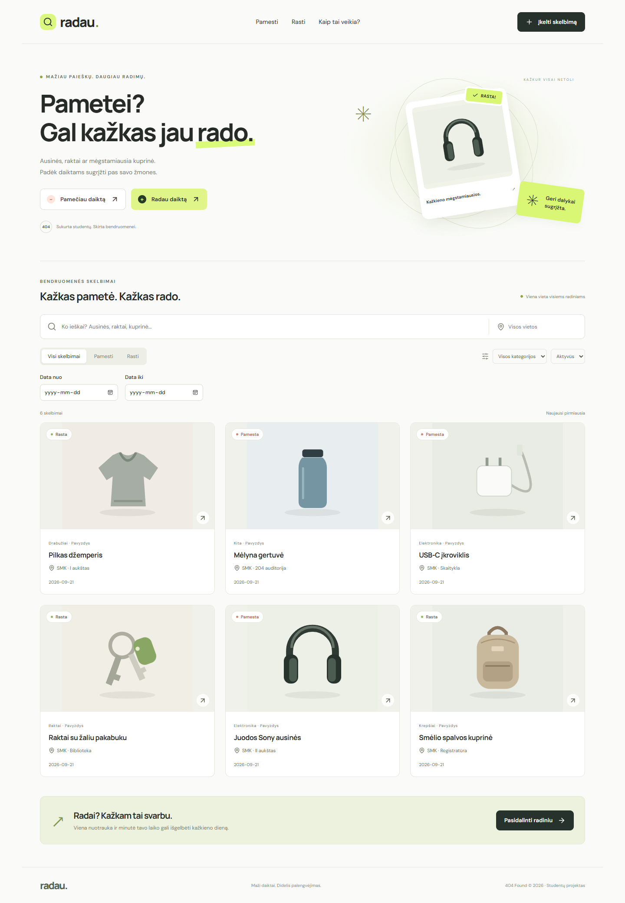
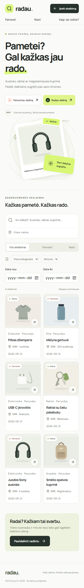
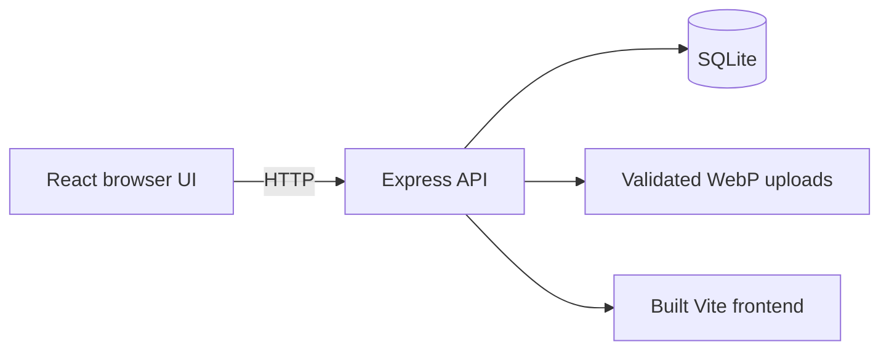

# Radau

**Pametei? Gal kažkas jau rado.**

A Lithuanian lost-and-found web application for students and educational communities. University project by **404 Found**: Lukas, Aleks, Andrej and Rokas. The aim is a useful, understandable student MVP, without monetization.

## Problem

Lost-item information is scattered across chats, social networks and reception desks. Students need one place to publish details, search and check whether an item has already been returned.

## Solution and features

- Lost/found listings with title, description, category, location, event date, contact and optional photo.
- Case-insensitive search across title, description and location.
- Combined type, category, location, date interval and active/returned filters preserved in the URL.
- Detail pages and creator-controlled resolution using a secret management code.
- Persistent SQLite records and validated/resized WebP uploads.
- Lithuanian validation, loading/empty/error states, mobile navigation and image fallback.
- Six labelled fictional demo listings, seeded only into an empty database.

## Screenshots

Screenshots come from automated tests with fictional data.





## Architecture and technologies



React 19, React Router 7, Vite 7, Node.js 24, Express 5, built-in `node:sqlite`, Multer, Sharp and Lucide. Tests use Node's test runner and Playwright. One server and local database keep the implementation approachable. See [architecture and API](docs/ARCHITECTURE.md).

## Local development

Install **Node.js 24.x** and npm. From this directory:

```sh
npm ci
npm run dev
```

Open `http://127.0.0.1:5173`. The API runs on port 3001. Stop production before starting development because both use that API port. No external database or API account is required.

Production build:

```sh
npm ci
npm run build
npm start
```

Open `http://127.0.0.1:3001`. This is a local address; keep the existing proxy/tunnel for external access. [Deployment and updates](docs/DEPLOYMENT.md) explain persistent data and the verification boundary.

For a populated demonstration, after building and stopping any server on port 3001:

```sh
npm run demo
```

This seeds only an empty database. Existing records are preserved. Demo contacts use `example.invalid` and are intentionally nonfunctional. Create a new fictional listing to demonstrate the management-code flow.

Optional settings: copy `.env.example` to `.env`. `PORT` sets the server port. `DATA_DIR` and `UPLOAD_DIR` select persistent storage; default paths are anchored to the project. Keep port 3001 for Vite development unless its proxy is also updated. Never publish real `.env` values or user records.

## Project structure

```text
src/                 React pages, components, API helper and CSS
shared/listings.js   Shared categories, field rules and date validation
server/app.js        API, storage, image processing and errors
server/index.js      Startup, configuration and shutdown
server/schema.sql    SQLite table and indexes
public/              Favicon and demo illustrations
tests/              API, restart and browser scenarios
docs/               Plan, architecture, test results and demo script
data/               Runtime SQLite files (private, ignored)
uploads/            Runtime photos (private, ignored)
```

## Testing

```sh
npm run build
npm test
npm run test:browser
```

Tests use temporary databases and never reset application data. Build first so the production restart test runs. Browser tests use installed Edge on Windows. Elsewhere install Chromium with `npx playwright install chromium`; the test then uses Chromium. `BROWSER_CHANNEL` can select another supported installed channel.

Coverage includes lost/found creation, optional photos, malformed/oversized uploads, validation, combined filters, detail reload, incorrect/correct management codes, resolution, process restart, network retry, missing images and mobile layout. [Recorded results](docs/TEST_RESULTS.md) distinguish automated checks from unperformed research.

## Current status

The local MVP build and core user flows are verified. The user reports an existing deployment environment; this revision has not been uploaded to or tested on that remote server. Existing listings and database schema are preserved.

There are no accounts, editing/deletion UI, code recovery, automated moderation or rate limiting. Search is unpaginated and intended for a small dataset. Anyone holding a listing's management code can resolve it. Contacts are public and unverified. Wider public use needs moderation/data removal, abuse controls and disk monitoring.

## Team

| Member | Role |
|---|---|
| Lukas | Project Manager / coordination |
| Aleks | Proposed: UI/UX, requirements and frontend |
| Andrej | Proposed: backend and API |
| Rokas | Proposed: database and testing |

Technical assignments come from planning documents, not verified contribution history. Implementation and refinements used Codex assistance. The team should review the code and record actual contributions in version control.

## Documentation

- [Project plan, requirements and milestones](docs/PROJECT_PLAN.md)
- [Architecture and data flow](docs/ARCHITECTURE.md)
- [Five-minute demo](docs/DEMO_SCRIPT.md)
- [Initial audit](docs/AUDIT.md)
- [Publication checklist](PUBLICATION_CHECK.md)
- [Original Lithuanian course plan](docs/PROJEKTO-PLANAS.md)

## Future ideas

After user testing: accounts, listing management, moderation, notifications and transparent matching by category/location/date/keywords. AI matching is not implemented and is not required for presentation.
