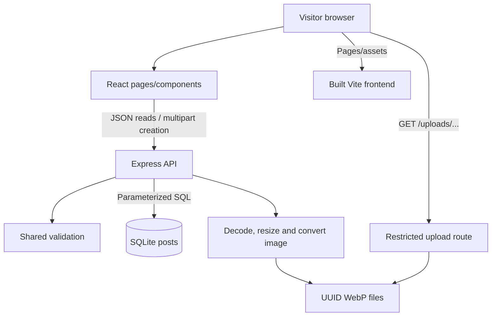

# Implemented architecture

React 19 and React Router provide the Lithuanian UI, Vite 7 handles development/build, Express 5 runs on Node.js 24, `node:sqlite` stores records, Multer parses multipart forms and Sharp decodes/converts images. There are no accounts, microservices, ORM, external AI services or payments.

Development: Vite on 5173 proxies `/api` and `/uploads` to the local API on 3001. Production: Express serves API and built UI. Loopback binding is unchanged; the existing deployment forwards traffic to it. That remote layer was not inspected or reconfigured.

## Data flow

1. The form checks `shared/listings.js` rules and sends multipart data.
2. Express parses bounded fields and validates again. Server rules are authoritative.
3. Optional JPEG/PNG/WebP is decoded with a 25-million-pixel limit, resized to at most 1400 px and re-encoded as WebP without original metadata. Filename is generated, never taken from the upload name.
4. A listing and SHA-256 hash of a random 24-byte management code are stored. Only the creation response returns the actual code.
5. The browser displays the code and attempts localStorage caching. Clipboard copying has a manual-copy fallback. This is a per-listing capability, not an account/session.
6. Reads select public columns only. SQL applies type/category/status/inclusive-date filters. JavaScript applies Lithuanian case folding to title/description/location search.
7. Resolution verifies the code hash and sets `status=returned`; the original type and other data remain intact.

## Schema

The existing `posts` table is preserved; see `server/schema.sql`.

| Columns | Purpose |
|---|---|
| `id` | UUID primary key |
| `type` | lost or found |
| `title`, `description`, `category`, `location`, `date`, `contact` | Public details |
| `image` | Nullable public image path |
| `status` | active or returned |
| `manage_hash` | Private hash, excluded from read responses |
| `is_demo` | Explicit fictional-record flag |
| `created_at` | UTC creation timestamp |

Indexes: `(type,status)` and `created_at`. SQLite uses WAL and a five-second busy timeout. Default paths are anchored to the project, independent of launch directory. Optional `DATA_DIR` and `UPLOAD_DIR` select persistent locations. Demo seeding only acts on an empty table.

## Routes

| Method / path | Behavior |
|---|---|
| GET `/api/health` | Minimal availability response |
| GET `/api/categories` | Allowed categories |
| GET `/api/posts` | Public array, filters: q/type/category/location/status/from/to |
| GET `/api/posts/:id` | Public record or 404 |
| POST `/api/posts` | Multipart creation, 201 `{id, manageToken}` |
| PATCH `/api/posts/:id/resolve` | Code in Authorization Bearer header, updates status |
| GET `/uploads/:filename` | Existing UUID WebP only, otherwise 404 |

Pages: `/`, `/pamesti`, `/rasti`, `/naujas`, `/skelbimai/:id`, `/kaip-veikia`. Unknown pages use a React 404 view with the SPA shell's HTTP 200. Missing API records/assets return HTTP 404.

## Validation and errors

Trimmed lengths: title 3–100, description 10–2000, location 2–150, contact 5–200. Type/category use allowlists. Event dates must exist and cannot exceed today's Europe/Vilnius date. Contact remains unverified plain text.

One image, at most 5 MiB, with bounded field lengths and part count. Executables/SVGs disguised as images fail validation. Missing uploads never fall through to HTML. Failed DB insertion cleans up only its own newly written file.

Errors use JSON messages; internal failures are logged server-side. The browser provides Lithuanian feedback, retries, stale-request cancellation and image fallback. Production headers include CSP, no-sniff, frame denial and same-origin referrer policy. Vite development does not use these server headers.

## Limitations

Results are unpaginated and search scans the filtered set; no scale claim. File and DB writes are not a single transaction, so an abrupt crash between them can leave an unreferenced file. There is no automated spam control, moderation, deletion UI or code recovery. Anyone with a management code can resolve that item. Contact information is public by design. Optional Google Fonts falls back to system fonts offline.
