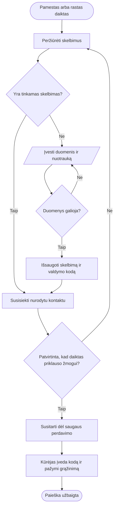

# Radau / 404 Found

> Pradinis 2026-09-22 dokumentas. Dabartinę 2026-09-24 būseną žr. [PROJECT_PLAN.md](PROJECT_PLAN.md), [ARCHITECTURE.md](ARCHITECTURE.md) ir [TEST_RESULTS.md](TEST_RESULTS.md).

Projekto valdymo planas ir techninė specifikacija · v0.1 · 2026-09-22

Komanda: Lukas, Aleks, Andrej, Rokas. Šis dokumentas yra pradinis pasiūlymas komandai. Datos ir darbo valandų įverčiai nėra dėstytojos nustatyti terminai.

## 1. Idėjos analizė ir projekto pagrindimas

Studentai pamestų daiktų ieško Messenger, Discord, Facebook grupėse, registratūroje ir per pažįstamus. Informacija išsiskaido, skelbimai pasimeta, nėra aišku, ar daiktas jau grąžintas. „Radau“ sutelkia pamestų ir rastų daiktų skelbimus vienoje paieškoje.

Pagrindinė auditorija: studentai, dėstytojai ir mokymo įstaigos darbuotojai. Pradinė taikymo aplinka: viena institucija, pvz., SMK. Institucijos dalyvavimas kol kas yra prielaida, o ne patvirtinta partnerystė. Projektas nekomercinis, mokėjimai ir reklama neplanuojami.

Vertė: greitai paskelbti, lengvai ieškoti, tiesiogiai susisiekti ir pažymėti, kad paieška baigta. Didžiausia produkto rizika yra ne AI trūkumas, o per mažai skelbimų ir nežinojimas apie platformą. Prieš pilotą Aleks ir Lukas apklausia 5 studentus bei vieną registratūros darbuotoją: kur dabar kreipiamasi, kokios detalės padeda atpažinti daiktą, kas galėtų prižiūrėti skelbimus. Šios apklausos dar neatliktos.

## 2. SMART tikslas ir sėkmės kriterijai

Siūlomas tikslas: per 6 savaites nuo komandos patvirtinto starto sukurti ir universitete pademonstruoti veikiantį prototipą, kuriame vartotojas be paskyros gali paskelbti pamestą arba rastą daiktą, pridėti nuotrauką, surasti skelbimą ir su valdymo kodu pažymėti daiktą grąžintu.

| SMART dalis | Patikrinamas kriterijus |
|---|---|
| Konkretus | Vienos institucijos pamestų ir rastų daiktų svetainė |
| Išmatuojamas | Veikia FR-01–FR-10, visi kritiniai priėmimo testai sėkmingi |
| Pasiekiamas | 4 studentai, vienas React projektas, vienas Express serveris, SQLite |
| Aktualus | Sprendžia skelbimų išsiskaidymo problemą, nėra monetizavimo užduočių |
| Apribotas laiku | 6 savaičių planas, demonstracija šeštos savaitės pabaigoje |

Papildomi piloto tikslai: bent 4 iš 5 pakviestų studentų savarankiškai sukuria skelbimą per 2 minutes ir randa nurodytą įrašą per 30 sekundžių. Tai siekiami rezultatai, ne jau atlikto tyrimo išvados.

## 3. Suinteresuotosios šalys ir atsakomybės

| Dalyvis | Interesas / atsakomybė | Įtraukimas |
|---|---|---|
| Studentai | Rasti daiktą, lengvai susisiekti | Pradinės apklausos, piloto užduotys |
| Registratūra | Patogiai skelbti radinius ir juos perduoti | Proceso aptarimas prieš pilotą |
| Dėstytoja | Projekto planas, vaidmenys, reikalavimai, proceso įrodymai | Etapų demonstracijos per paskaitas |
| 404 Found | Veikiantis, suprantamas ir perduodamas projektas | Bendra užduočių lenta ir kodo peržiūros |

| Narys | Pagrindinis vaidmuo | Konkretūs rezultatai | Peržiūri |
|---|---|---|---|
| Lukas | PM / Front-end | Apimtis, planas, integracija, maršrutai, demonstracija | Aleks |
| Aleks | UI/UX / Front-end / BA | Apklausos, reikalavimai, formos, prieinamumas | Lukas |
| Andrej | Back-end | API, validacija, nuotraukos, valdymo kodo patikra | Rokas |
| Rokas | Database / Testing | Schema, testų scenarijai, atsarginės kopijos | Andrej |

BA atsakomybė paskirta Aleks su Luko pagalba, nes paskaitose analitiko vaidmuo aiškiai atskirtas. Sprendimus supranta visa komanda. Vienas narys negali būti vienintelis, mokantis paleisti sistemą.

## 4. Apimtis

MVP: pradinis puslapis, bendras ir atskiri pamestų / rastų sąrašai, kūrimo forma, pasirenkama nuotrauka, kategorija, vieta, įvykio data, aprašymas, viešas kontaktas, tekstinė paieška, kategorijos / vietos / būsenos filtrai, individualus puslapis ir grąžinimo būsena. Nuotrauka neprivaloma, nes pamesto daikto nuotraukos žmogus gali neturėti. Sąrašai rikiuojami pagal paskelbimo laiką, naujausi pirmiausia.

Po MVP: paskyros, mėgstami skelbimai, pranešimai, komentarai, žemėlapis, institucijų bendruomenės, administratoriaus sąsaja, QR kodai. Moderavimas ir duomenų šalinimo tvarka turi būti išspręsti prieš realų viešą pilotą, nors netrukdo vietinei universiteto demonstracijai.

AI sutapatinimas, nuotraukų atpažinimas ir panašumo procentas tik po veikiančio MVP ir pakankamai testinių duomenų. „87 %“ negali būti atsitiktinis UI skaičius: reikia apibrėžti skaičiavimą ir įvertinti klaidingus sutapimus. Pradžioje žmonės patys ieško ir tikrina išskirtines detales.

## 5. Funkcionalumas ir reikalavimai

Pagal rugsėjo 22 d. paskaitą funkcionalumas nusako, ką sistema daro, o reikalavimai nustato taisykles ir išimtis.

| ID | Reikalavimas ir priėmimo sąlyga |
|---|---|
| FR-01 | Pagrindiniame puslapyje yra dvi kūrimo kryptys: „Pamečiau“ ir „Radau“. Pasirinkimas perduodamas formai. |
| FR-02 | `/pamesti` pateikia tik lost, `/rasti` tik found skelbimus. Pagal nutylėjimą rodomi aktyvūs. |
| FR-03 | Sukuriamas skelbimas su tipu, 3–100 simbolių pavadinimu, 10–2000 simbolių aprašymu, leidžiama kategorija, 2–150 simbolių vieta, data ir 5–200 simbolių kontaktu. Serveris atmeta netinkamus duomenis. |
| FR-04 | Leidžiama viena JPG, PNG arba WebP nuotrauka iki 5 MB. Serveris tikrina tikrą failo turinį, perrašo į WebP, sumažina iki 1400 px ir pašalina metaduomenis. Netinkamas failas nekuria skelbimo. |
| FR-05 | Įvykio data turi egzistuoti ir negali būti ateityje pagal Europe/Vilnius datą. |
| FR-06 | Paieška tikrina pavadinimą, aprašymą ir vietą, nepaisydama raidžių dydžio. Lietuviškos raidės išsaugomos; diakritikai neignoruojami. |
| FR-07 | Vietos tekstas, kategorija ir būsena veikia kartu su paieška. Filtrai išsaugomi URL. Tuščias rezultatas turi paaiškinimą. |
| FR-08 | Individualiame puslapyje matomi daikto duomenys, nuotrauka ir kontaktas. Neegzistuojantis ID grąžina 404. |
| FR-09 | Kūrėjas gauna atsitiktinį valdymo kodą. Tik teisingas kodas leidžia pakeisti būseną į returned. Kodo maiša saugoma DB, pats kodas API sąraše nerodomas. |
| FR-10 | Grąžintas skelbimas išlieka istorijoje, dingsta iš aktyvių ir pasiekiamas pasirinkus „Grąžinti“. Pradinis lost / found tipas nesikeičia. |

Kontaktas šiame etape yra laisvas tekstas: jis nėra patvirtintas el. paštu ar SMS. Skelbimų redagavimas, ištrynimas ir valdymo kodo atkūrimas dar neįgyvendinti. Praradus kodą prireiks DB administratoriaus pagalbos.

| ID | Nefunkcinis reikalavimas | Patikrinimas |
|---|---|---|
| NFR-01 | UI telpa 375 px ir 1440 px pločio ekranuose | Naršyklės peržiūra, nėra horizontalaus slinkimo |
| NFR-02 | Formų laukai turi etiketes, mygtukai pasiekiami klaviatūra | Tab / Enter bandymas, matomas fokusas |
| NFR-03 | Duomenys išlieka perkrovus serverį | Sukūrimas, proceso perkrovimas, pakartotinis skaitymas |
| NFR-04 | Paieškos atsakas vietinėje demonstracijoje su 100 įrašų mažiau nei 1 s | Atskirai pamatuoti prieš pilotą; tikslas dar nepatvirtintas |
| NFR-05 | Būsenos keitimas be kodo negalimas, DB užklausos parametrizuotos | API neigiami testai |
| NFR-06 | Naujas komandos narys paleidžia projektą pagal README | Švari instaliacija kitame kompiuteryje; komandos užduotis |

## 6. Procesas



Sistema nepatvirtina nuosavybės ir neorganizuoja fizinio perdavimo. Kūrėjas ir besikreipiantis žmogus tai atlieka už programos ribų.

## 7. Architektūra ir pasirinkimų priežastys

```mermaid
flowchart LR
 A[React naršyklėje] -->|HTTP /api| B[Express Node.js]
 B -->|Parametrizuotas SQL| C[(SQLite failas)]
 B -->|Patikrintas WebP| D[uploads aplankas]
```



React + Vite leidžia mokytis komponentų ir greitai matyti pakeitimus. JavaScript abiejose pusėse sumažina mokymosi krūvį. Express pateikia nedidelį REST API. SQLite nereikalauja DB paskyros ar atskiro serverio; SQL užklausas lengva aptarti paskaitoje. Node.js 24 `node:sqlite` leidžia išvengti papildomo SQLite adapterio, tačiau ši API Node 24 dokumentacijoje pažymėta eksperimentine, todėl komanda turėtų laikytis nurodytos Node versijos. Prireikus vėliau galima keisti adapterį ar pereiti į PostgreSQL.

Vienas serveris pateikia API, failus ir paruoštą React aplikaciją. Kūrimo metu Vite `/api` ir `/uploads` užklausas nukreipia į Express. Nėra mikroservisų, Docker, ORM, Redis ar AI priklausomybių. Tai vietinis prototipas, ne jau publikuota interneto paslauga.

Autentifikacijos kompromisas: valdymo kodas suteikia teisę užbaigti vieną skelbimą. Jis laikomas naršyklės localStorage patogumui ir parodomas išsisaugoti. Kodą turintis asmuo gali keisti būseną, todėl jo negalima dalintis viešai. Viešai diegiant būtini HTTPS, užklausų ribojimas, moderavimas ir atsarginių kopijų tvarka. Dabartinis serveris sąmoningai klausosi tik 127.0.0.1.

Techniniai šaltiniai: [Vite dokumentacija](https://vite.dev/guide/), [Node.js 24.16 SQLite dokumentacija](https://nodejs.org/download/release/v24.16.0/docs/api/sqlite.html). Paskaitų nuorodos į kitus straipsnius nebuvo naudojamos kaip savarankiškai perskaityti šaltiniai.

## 8. Projekto struktūra

```text
src/
  main.jsx          React paleidimas
  App.jsx           Puslapiai ir maršrutai
  components.jsx    Header, ItemCard, Badge, Empty, ErrorBox
  api.js            Bendra HTTP užklausų funkcija
  styles.css        Dizaino ir adaptyvumo taisyklės
server/
  index.js          Serverio paleidimas
  app.js            API, validacija, failų apdorojimas
  schema.sql        DB lentelė ir indeksai
public/
  favicon.svg
  illustrations/    Vietinės demonstracinių daiktų iliustracijos
tests/
  api.test.js       API ir duomenų išlikimo testai
docs/               Planas, testavimas, skaidrių tekstas
data/               Vietinė SQLite DB, nekelti į Git
uploads/            Vartotojų nuotraukos, nekelti į Git
```

Kol puslapių mažai, jų laikymas viename App.jsx palengvina susipažinimą. Komandai pradėjus dirbti lygiagrečiai, perkelti Feed, Create, Detail, How į atskirus `src/pages/` failus, nekeičiant elgsenos. Tai pirmas refaktoringo darbas, o ne nauja architektūra.

## 9. Duomenų bazė

Vienas skelbimas yra vienas `posts` įrašas. SQL schema yra `server/schema.sql`.

| Laukas | Tipas | Paskirtis |
|---|---|---|
| id | TEXT PK | UUID, viešas identifikatorius |
| type | TEXT CHECK | lost arba found, pradinis skelbimo tipas |
| title, description | TEXT NOT NULL | Pavadinimas ir aprašymas |
| category | TEXT NOT NULL | Viena iš 6 serverio kategorijų |
| location | TEXT NOT NULL | Laisvas vietos tekstas |
| date | TEXT NOT NULL | Įvykio data YYYY-MM-DD |
| contact | TEXT NOT NULL | Viešai rodomas kontaktas |
| image | TEXT NULL | Vietinis nuotraukos URL, ne failo turinys |
| status | TEXT CHECK | active arba returned |
| manage_hash | TEXT NOT NULL | Valdymo kodo SHA-256 maiša |
| is_demo | INTEGER | Išgalvoto pavyzdžio žyma |
| created_at | TEXT NOT NULL | Sukūrimo laikas UTC |

UI būseną „Pamesta“ / „Rasta“ gauna iš type, kai status=active. Būsena returned vaizduojama „Grąžinta“. Taip grąžinimas nepraranda informacijos apie pradinį skelbimo tipą. Kategorijų atskiros lentelės kol kas nereikia, nes sąrašas fiksuotas. Atsiradus paskyroms pridėti users ir nullable posts.user_id, neperkurti senų skelbimų.

## 10. Puslapiai, API ir komponentai

| Puslapis | Paskirtis |
|---|---|
| `/` | Pagrindiniai veiksmai, naujausi aktyvūs skelbimai, paieška |
| `/pamesti`, `/rasti` | Filtruoti sąrašai |
| `/naujas?type=lost` arba `found` | Skelbimo forma ir sėkmės patvirtinimas |
| `/skelbimai/:id` | Detalės, kontaktas, būsenos keitimas |
| `/kaip-veikia` | Naudojimosi paaiškinimas |

| API | Rezultatas |
|---|---|
| GET `/api/categories` | Kategorijų sąrašas |
| GET `/api/posts?q=&type=&category=&location=&status=` | Filtruoti įrašai, naujausi pirmiausia |
| GET `/api/posts/:id` | Vienas skelbimas arba 404 |
| POST `/api/posts` | multipart/form-data, 201 ir `{id, manageToken}` |
| PATCH `/api/posts/:id/resolve` | Authorization: Bearer kodas; 200 arba 403 / 404 |

Pakartotiniai UI komponentai: Header, ItemCard, Badge, Empty, ErrorBox. Paieška ir filtrai sudaro bendrą Feed puslapį. Mygtukų, formų ir kortelių stiliai bendri. Naudojama lietuviška sąsaja, švelnus žalios ir laimo spalvos akcentas, aiškiai atskiriamos pamestų ir rastų būsenos tekstu ir spalva.

## 11. WBS ir šešių savaičių planas

Šio prototipo sugeneravimas yra startinis pagrindas. Komandos mokymosi, peržiūros, piloto ir dokumentų patvirtinimo darbai lieka reikalingi.

| WBS | Savaitė | Maža užduotis / rezultatas | Atsakingas | Priklausomybė | Įvertis |
|---|---|---|---|---|---|
| 1.1 | 1 | 5 studentų ir registratūros apklausa | Aleks | – | 4 h |
| 1.2 | 1 | Patvirtinti apimtį, kriterijus, lentą | Lukas | 1.1 | 3 h |
| 1.3 | 1 | Visi paleidžia prototipą savo kompiuteryje | Visi | – | 4 h |
| 2.1 | 2 | Patikrinti mobile / desktop maketą | Aleks | 1.2 | 4 h |
| 2.2 | 2 | Peržiūrėti SQL schemą ir demo įrašus | Rokas | 1.2 | 3 h |
| 2.3 | 2 | Išskaidyti puslapius, aptarti API sutartį | Lukas, Andrej | 1.3 | 4 h |
| 3.1 | 3 | Ištestuoti formos laukus ir išimtis | Andrej, Rokas | 2.2 | 5 h |
| 3.2 | 3 | Patikrinti nuotraukų įkėlimą ir klaidas | Andrej | 3.1 | 4 h |
| 3.3 | 3 | Patikrinti paiešką su lietuviškais duomenimis | Lukas | 2.3 | 3 h |
| 4.1 | 4 | Patikrinti valdymo kodą ir būsenas | Andrej, Rokas | 3.1 | 4 h |
| 4.2 | 4 | Klaviatūros ir telefono UX peržiūra | Aleks | 3.2 | 4 h |
| 4.3 | 4 | Atsarginės kopijos ir atkūrimo bandymas | Rokas | 2.2 | 3 h |
| 5.1 | 5 | 5 vartotojų pilotas su netikrais kontaktais | Aleks, Lukas | 4.1, 4.2 | 5 h |
| 5.2 | 5 | Prioritetinės klaidos ir regresija | Visi | 5.1 | 8 h |
| 6.1 | 6 | Užfiksuoti testų įrodymus, README, ribojimus | Rokas | 5.2 | 4 h |
| 6.2 | 6 | 5 minučių demo ir klausimų repeticija | Visi | 6.1 | 4 h |
| 6.3 | 6 | Retrospektyva, perdavimas, kito etapo backlog | Lukas | 6.2 | 2 h |

Iš viso 73 komandos darbo valandos + apie 15 h rezervas. Tai preliminarus suminis darbo, o ne kiekvieno nario valandų įvertis. Kiekvieną savaitę palyginti planą su faktu ir perskirstyti užduotis. Gairės: S1 patvirtinti reikalavimai, S3 pilnas kūrimo srautas, S4 MVP priėmimas, S6 demonstracija ir perdavimas.

Resursai: turimi kompiuteriai, Node.js 24, naršyklė, redaktorius, Git ir bendras repozitoriumas. Vietinei demonstracijai papildomas piniginis biudžetas 0 EUR, darant prielaidą, kad įranga ir internetas jau turimi. Hostingo ir domeno išlaidos neįtrauktos, nes viešas diegimas dar nesuplanuotas.

## 12. Komunikacija, pokyčiai ir pažangos stebėjimas

Siūloma viena komandos Discord grupė greitiems klausimams ir GitHub Issues užduotims. Tai siūlomi įrankiai, paskyros ir repozitoriumas šio darbo metu nesukurti. Kas savaitę 20 min aptarimas: kas baigta, kas blokuoja, ką darome toliau. Prieš paskaitą Lukas parengia trumpą būseną dėstytojai. Sprendimai įrašomi į dokumentus, nepaliekami tik pokalbiuose.

Lenta: Backlog → Ready → In progress → Review → Done. Vienas pagrindinis darbas vienam žmogui vienu metu. Kiekviena užduotis turi savininką, priėmimo kriterijų ir patikrą. PR peržiūri bent vienas kitas narys. Savaitės ataskaita: data, baigtos WBS užduotys, faktinės valandos, nukrypimas nuo plano, rizikos, kitos savaitės tikslas.

Pokytis: aprašyti poreikį → įvertinti darbą ir įtaką terminui → komanda su PM nusprendžia MVP ar backlog → atnaujinti reikalavimą ir testą. Jei nauja funkcija didina apimtį, išimti lygiavertį darbą arba aiškiai perplanuoti terminą. AI užduotis negali tyliai patekti į MVP.

## 13. Rizikų registras

| Rizika | Tikimybė / poveikis | Prevencija ir reakcija | Savininkas |
|---|---|---|---|
| Apimtis išauga dėl AI ir paskyrų | Aukšta / aukštas | Užšaldyti MVP, papildymus rašyti į backlog | Lukas |
| Nariai dirba nesuderintuose failuose | Vidutinė / vidutinis | Maži PR, sutarta API, paskirstyti puslapius | Lukas |
| Nuotrauka netinkama ar per didelė | Vidutinė / vidutinis | Serverio ribos, formato dekodavimas, aiški klaida | Andrej |
| Prarastas valdymo kodas | Vidutinė / vidutinis | Aiškus išsisaugojimas, vėliau paskyros | Aleks |
| Paviešinti asmeniniai duomenys | Vidutinė / aukštas | Formos paaiškinimas, pilotui netikri kontaktai, prieš viešinimą šalinimo procesas | Lukas |
| DB ar failų praradimas | Žema / aukštas | Kopijuoti DB ir uploads kartu, patikrinti atkūrimą | Rokas |
| Trūksta laiko arba narys nedalyvauja | Vidutinė / aukštas | 20 % rezervas, kitas narys moka paleisti ir paaiškinti modulį | Lukas |
| Niekas nesinaudoja platforma | Vidutinė / aukštas | Ankstyvos apklausos, registratūros įtraukimas, mažas pilotas | Aleks |

## 14. Kokybė, užbaigimas ir perdavimas

Definition of Done: tenkinamas reikalavimas, nėra kritinės klaidos, kitas narys peržiūrėjo kodą, susiję testai sėkmingi, atnaujinti naudojimo paaiškinimai. „Build sėkmingas“ savaime neįrodo teisingos vartotojo eigos.

Projekto etapą laikome užbaigtu, kai pademonstruojamas visas ciklas nuo paskelbimo su nuotrauka iki grąžinimo, kitas komandos narys paleidžia projektą, išsaugomi testų įrodymai, perduodami failai ir užfiksuojamos žinomos ribos. Dėstytojos vertinimo ar patvirtinimo šiuo dokumentu neteigiame.

## 15. Ryšys su pateiktomis skaidrėmis

| Šaltinis | Skaidrės | Taikymas šiame projekte |
|---|---|---|
| 2026-09-08 IT Project management | 9, 12–17 | Gyvavimo ciklas, apimtis, terminai, kokybė, vaidmenys |
| 2026-09-15 IT Project management | 6–8, 11–19 | PM atsakomybės, tikslai, stakeholders, WBS, grafikas, resursai, rizikos, komunikacija, kokybė |
| 2026-09-15 IT Project management | 20–21 | Dokumentų paskirtis ir komandos vaidmenys |
| 2026-09-22 IT Project management | 4–5, 9–14 | Funkcionalumas ir taisyklės, proceso diagrama, funkciniai reikalavimai |
| 2026-09-22 IT Project management | 15–23, 25–26, 29–32 | SMART, analitiko atsakomybė, funkciniai ir nefunkciniai kriterijai |

Šaltinių tekstas ištrauktas į `skaidriu-tekstas.txt`. Kai kuriose skaidrėse esanti sena 2024 m. namų darbų data neperkelta į šio projekto grafiką. Skaidrėse esančių diagramų vaizdai nebuvo vertinami kaip papildomi tekstu neišreikšti reikalavimai.
